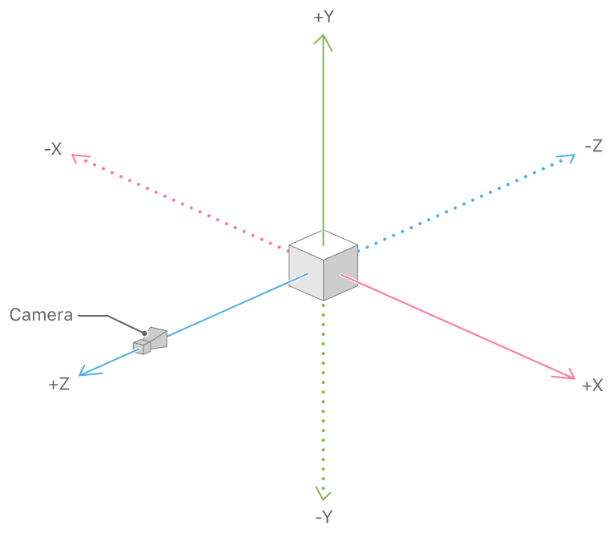
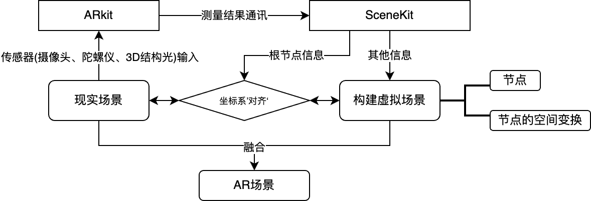

# __AR穴位定位APP技术细节__

*   作者：蔡俊志
*   日期：2023.5.22 
*   转载请注明出处

## __关键词__

中医穴位、iOS、AR、ARkit、SceneKit、homogeneous coordinate


## __初始化AR__

>注意：这一节是在初始化AR，不是初始化AR场景

### __ARkit 综述__
ARkit是Apple为开发者提供的实现AR功能的API，其主要能面向开发者提供或设置：

*   __[摄像机视频管线](https://developer.apple.com/documentation/arkit/choosing_which_camera_feed_to_augment)__ (camera-capture pipeline)：其抽象了ARkit对于摄像机画面的内在处理过程，向开发者提供了隐去ARkit管理摄像机的细节内容之后的视频信号接口。
*   __某件物体的__ [__ARAnchor__](ARAnchor)：包含某件物体的细节，比如说大小，空间位置等。接下来的章节，我们可以设置这件特殊的物体是面部，ARkit就会返回面部的ARAnchor和其他信息（如侦测到面部）
*   __场景的测量信息__：ARkit能够：估计真实的物理场景形状、实现虚拟场景和现实场景的映射参数（也可以说是对其）、估计真实物理场景的光照
*   more...


[Documentation](https://developer.apple.com/documentation/arkit/arconfiguration)


初始化一个AR的过程，本质上就是开发者配置上面所讲的内容过程（比如说，对于 __摄像机视频管线__，我们需要配置需要前置还是后置摄像头，分辨率如何。再比如对于 __某件物体的__ [__ARAnchor__]()，我们可以把他设定为地面之类的）。


我们通过 [__ARConfiguration__](https://developer.apple.com/documentation/arkit/arfacetrackingconfiguration) 这个类的实例来配置ARkit（初始化AR），这是我们把玩AR的起点。

这个时候，你可能会在想，既然要实现AR脸部穴位追踪，我们需要ARkit获得的
[__ARAnchor__]()应该是我们的面部，使用的摄像头应该是前置摄像头，以及，应该通过3D结构光来获得更精细的面部建模。听起来我们需要设置很多东西，但是实际上，苹果早就给我们提前设置好了一切，我们只需要像下面这样就可以把面部AR给初始化了。其中，变量configuration保存了我们对AR场景的设置。

```swift
let configuration = ARFaceTrackingConfiguration()
```

当然，可以手动修改 __ARConfiguration__ 实例中的部分参数，比如说在这里，我关闭了自动估计现实光照。

```swift
configuration.isLightEstimationEnabled = false
```
## __初始化AR场景__

我们完成了AR的配置，这相当于是制定了一套AR的法律，设置了ARkit的行为。这里，我们需要一个虚拟场景来作为实施这套法律的对象。换句话说，我们现在需要把手中的 __"AR"__ 变成 __"AR场景"__。

这里我使用的是苹果的 __SceneKit__ 

### __Scenekit综述__

SceneKit 是一种高性能渲染引擎，更确切的说，SceneKit是一个可以导入、操作和渲染3D资产的 __描述性API__，抽象、隐去了具体对渲染引擎的操作细节，开发者仅需描述场景，对于一个Scene，其比较重要的 __描述性参数__ 有：

*   SCNScene：场景对象
*   SCNCamera:3D场景的摄像机
*   SCNLight：3D场景的光照信息
*   more...

#### __初始化Scene__

初始化Scene和上面初始化AR的过程很类似，如果在这里我们想要配置一个用来作为AR虚拟物体的存放容器的场景，首先我们需要实例化一个 __空__ 的 __SCNView__ 的类，然后对这个示例进行配置。那么，对于我们的目标AR场景来说，不难想到，我们需要配置如下内容如下:
*   配置 __SCNScene__ 获得一个场景
*   配置 __SCNCamera__ 和手机上的 __前置摄像头__ 绑定
*   配置 __SCNLight__ 给场景打光
    *   值得一提的是，ARkit可以根据现实场景估计光照，这个估计的光照就可以和SCNLight绑定，使虚拟世界的光照和现实世界的灯光绑定，从而带来更逼真的AR体验)
*   more..


听起来我们要配置的内容有点多，但是好消息是，Apple又提前写好了用于AR场景的SceneKit配置信息（感谢Apple），所以我们只需要像下面这样，就获得了一个适合AR的Scene。

```swift
let sceneView = ARSCNView()
```


#### __动态控制Scene__

有了Scene，我们需要在运行时控制这个Scene，因为场景并不是固定的东西，它的每一帧也许都需要更新，它的第一帧也许需要初始化一些物体，之后的每一帧都可能需要根据用户的操作去改编某些东西，所以我们需要编写一个用来控制Scene的类，在SceneKit中，这样用于控制Scene的类的协议是 __ARSCNViewDelegate__

这个协议要求类实现一些函数，对于我的AR中医穴位项目，我需要管理：

*   在最开始的时候初始化面部几何3D模型（模型由ARkit提供）
*   在运行中根据用户的选择，往面部增加或者减少穴位指示的3D节点

所以我创建了一个类名叫 __ARViewController__ 的类，并让他遵循 __ARSCNViewDelegate__ 协议，最后，我在类体里实现了协议中的两个函数。为了能够充分的理解我是如何操作Scene的，我们需要再了解一个SceneKit中非常重要的知识，那就是 __节点__


#### __SceneKit中的 节点（SCNNode）概念__:

SceneKit的3D模型的导入就像往一个树添加节点（下面将会称为SCNNode）的过程，任何想要被放置在Scene里面的对象（包括诸如灯光、摄像机、3D模型）都必须先包装成一个SCNNode，然后插入Scene树结构的某一个地方，那么，在什么东西都没有的时候，这棵树的根节点是什么呢？这个根节点其实就是整个Scene坐标系的$(x:0,y:0,z:0)$这个坐标点。（对了，SceneKit的坐标系统使用的是右手系，就像下面这样：



现在，我们用实现AR的角度来思考我们该如何定义SceneKit的根节点。首先，我们需要知道：AR场景的本质是什么，实际上就是 __虚拟坐标系__ 和 __现实坐标系__ 的 __对齐、映射__ 的过程，我们希望虚拟场景和现实场景无缝衔接。下面举几个例子:

*   如果我们想要在地面（现实中）上面建设我们的AR游乐园，那么Scenekit中的 __根节点__ 就应该和现实的地面 __绑定__。(从此，整个虚拟世界都会吧地面当做宇宙中心)
*   如果我们想要在手臂上（现实中）建设我们的AR游乐园，那么Scenekit中的 __根节点__ 就应该和我们的手臂 __绑定__。(从此，整个虚拟世界都会吧手当做宇宙中心)

在Scene所搭建的虚拟世界中，万物都会以根节点出发的坐标系来活动，在我的AR穴位APP中，这个根节点很显然就是我们的面部，倘若我们往Scene里面增加任何3D模型，这个3D模型看起来就会像是黏在了我们（现实中）的脸上一样。

>注意：我们需要在每一帧都将ARkit返回目标ARAnchor的数据更新到SceneKit的根节点中，因为在摄像机画面中你的脸往往会动来动去。

对于单个SCNNode，SceneKit提供了丰富的操作函数，包括但不限于：

*   通过传入变换矩阵来变换某个节点的空间位置、缩放其大小
*   改变这个节点所承载的3D模型
*   改变这个节点的透明度
*   改变这个节点的Material
*   控制这个节点是否产生阴影
*   控制这个节点会产生的物理效果
*   找到它的父母节点
*   找到它的子节点
*   移除它的所有子节点
*   .....

[Documentation](https://developer.apple.com/documentation/scenekit/scnnode)

#### __加载AR配置参数到Scene__

这里我们同样只需一行代码就能搞定这个过程，具体细节不详细解释。

```swift
sceneView.session.run(configuration)
```

#### __SCNNode的增删和空间变换__

虽然节点的功能很多，但是AR穴位APP仅用到了SceneKit中SCNNode的 __增删__ 和 __空间变换（包括位移和缩放）__ 这两组操作。

__对于增删：__

插入一个节点：

```swift
/*在根节点上插入一个子节点*/
rootNode.addChildNode(childNode)
```

移除一个节点：

```swift
/*遍历根节点的所有子节点，直到找到你要删除的那个节点*/
for node in rootNode!.childNodes
{
    if(node == TargetNode)
    {
        node.removeFromParentNode()
        break
    }
}
```

__对于空间变换：__


这里我们会用到一种叫做 __齐次坐标(homogeneous coordinate)__ 的工具来帮助我们完成对Scene中SCNNode变换的描述。

>齊次坐標在電腦圖形內無處不在，因為該坐標允許平移、旋轉、縮放及透視投影等可表示為矩陣與向量相乘的一般向量運算。

>任何空間的透視投影都能被表示為單一個矩陣 [From Wiki](https://zh.wikipedia.org/wiki/%E9%BD%90%E6%AC%A1%E5%9D%90%E6%A0%87)

用一句话来概括：在齐次坐标系统下，可以通过一个4维矩阵来描述一个3维物体在一个3维空间内的空间变换，其过程差不多就像下面这样:


在这篇文章，我不会介绍其详细内容，但是你可以通过下面的这个视频学习它，在接下来我会默认你已经了解了齐次坐标系系统，所以请务必了解它before you continue.

[视频地址](https://www.bilibili.com/video/BV1X7411F744?p=3&vd_source=09ea29595b1a52fc78897be565b1ec01)

__为什么我们需要空间变换:__

现在我们思考一个问题：在传统中医里，医生是如何用肉眼找到（面部的）穴位的？答案是：

*   __相对__ 五官的位置来定位

举个例子：
这是中医上的巨髎穴的位置，它是通过鼻子和眼睛相对来定位的，中医上的表述是这样：

>巨髎穴位于人体的面部，瞳孔直下，平鼻翼下缘处，当鼻唇沟外侧。[来自](https://baike.baidu.com/item/巨髎穴/6779266?fr=aladdin)


所以，其实我们提前知道面部五官的空间位置，然后在数学层面定位出穴位的位置。对于巨髎穴的例子：

*   我们假设眼睛的空间坐标为

$$(x_1,y_1,z_1)$$

*   然后假设鼻翼的空间坐标为

$$(x_2,y_2,z_2)$$

*   然后假设巨髎穴的空间坐标为

$$(x_3,y_3,z_3)$$

其中，根据 _"巨髎穴位于人体的面部，瞳孔直下"_，我们可以得出:

$$x_3 = x_1$$

根据 _"平鼻翼下缘处，当鼻唇沟外侧"_，我们可以得出:

$$y_3 = y_2$$

目测z轴坐标为:

$$z_3 = (z_1 + z_2) /2$$

至此，我们就得到了巨髎穴的空间坐标$(x_3,y_3,z_3)$，幸运的是，几乎所有面部穴位都可以用这个办法来建立数学模型定位。在穴位指示的3D模型导入Scene的时候，其默认坐标为 $(0,0,0)$，此时，我们就可以定义齐次坐标系的转换描述矩阵为

$$
\left(\begin{array}{cc} 
1 & 0 & 0 & x_3\\
0 & 1& 0 & y_3\\
0 & 0 & 1 & z_3\\
0 & 0 & 0 & 1
\end{array}\right)
$$ 

在SceneKit中，这样的矩阵可以通过这个数据结构来表示(上面矩阵的转置矩阵）：

```swift
simd_float4x4([
    [3,     0,      0,      0], 
    [0,     3,      0,      0], 
    [0,     0,      3,      0], 
    [0.08,  0.04,   -0.16,  1.0]
    ]
/*这里是对角线是3的原因是我想把最初的模型大小缩小3倍8*/
```

有了空间变换矩阵之后，我们可以利用以下代码对某个SCNNode进行空间变换

```swift
TargetNode.simdTransform = transMatrix
```

至此，理论层面已经论述完毕，希望下面这张图能够帮助你梳理思路:



## __从代码的视角演绎上面的内容__

首先，来看看我定义的一些全局变量

```swift
    var targetAcusReference: [SCNReferenceNode] = []    
    /*用于存放穴位指示模型的节点*/
    var targetAcusMatrix:[simd_float4x4] = []     
    /*每一个穴位的变换矩阵*/     
```
下面的这个函数重写了ARSCNViewDelegate协议中的一个函数，意义为初始化场景

```swift
/*用于初始化AR场景*/
func renderer(_ renderer: SCNSceneRenderer, nodeFor anchor: ARAnchor) -> SCNNode?
{
    /*设置场景的灯光信息*/
    lighting.type = .area
    lighting.castsShadow = true
    lighting.intensity = 4000
    
    /*从ARkit获取面部的几何网格，*/
    guard anchor is ARFaceAnchor else { return nil }
    let faceMesh = ARSCNFaceGeometry(device: sceneView.device!)
    /*将网格转换为SceneKit中的SCNNode*/
    contentNode = SCNNode(geometry: faceMesh)
    contentNode!.geometry?.firstMaterial?.transparency = .nan

    /*调用函数预处理穴位模型，把.usdc的模型文件转换为SceneKit的SCNNode对象*/
    self.preProcessNode()

    /*调用函数将穴位的SCNNode对象在Scene中作为面部节点的子节点插入*/
    self.attach()

    /*整个Scene的'树结构'返回*/
    return contentNode
}
```
上面代码段中的preProcessNode()如下所示

```swift
func preProcessNode()
{
    /*清空已有内容*/
    targetAcusReference.removeAll()
    targetAcusMatrix.removeAll()
    for item in fullacupoints
    {
        /*读入文件*/
        let targetFile:String = "ACU" + String(item.id)
        let newNode = SCNReferenceNode(named1: targetFile)
        /*将模型Node存入数组*/
        targetAcusReference.append(newNode)
        /*将模型的变换矩阵存入数组*/
        targetAcusMatrix.append(item.matrix)
    }
    for (index, value) in targetAcusReference.enumerated()
    {
        /*把每一个穴位Node都应用对应的变换矩阵*/
        value.simdPivot = targetAcusMatrix[index]
    }
}
```

上面代码段中的attach()如下所示

```swift
func attach()
{
    let anchorNode = contentNode else { return }
    /*将所有穴位作为子节点插入到根节点下*/
    for (index,AcuNode) in targetAcusReference.enumerated()
    {
        if(acupointsOnTheGo[index] == 1)
        {
            anchorNode.addChildNode(AcuNode)
        }
    }
}
```
下面的这个函数重写了ARSCNViewDelegate协议中的一个函数，意义为更新场景

```swift
func renderer(_ renderer: SCNSceneRenderer, didUpdate node: SCNNode, for anchor: ARAnchor)
{
    /*每帧都重新从ARkit获取根节点信息重定位根节点并更新面部建模*/
    if let faceAnchor = anchor as? ARFaceAnchor, 
    let faceGeometry = node.geometry as? ARSCNFaceGeometry
    {
        faceGeometry.update(from: faceAnchor.geometry)
    }
}
```

### 总结

至此，我已经论述完毕我是如何利用ARkit和Scenekit来将中医穴位通过AR直观展示在面部，其效果如下图所示:


